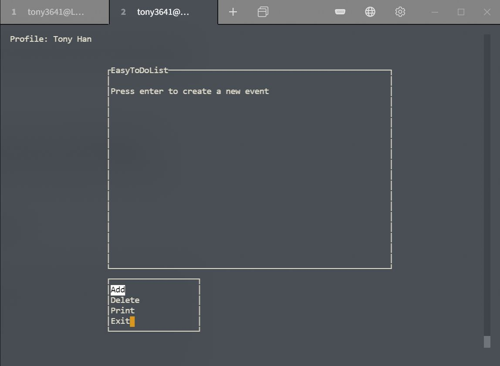
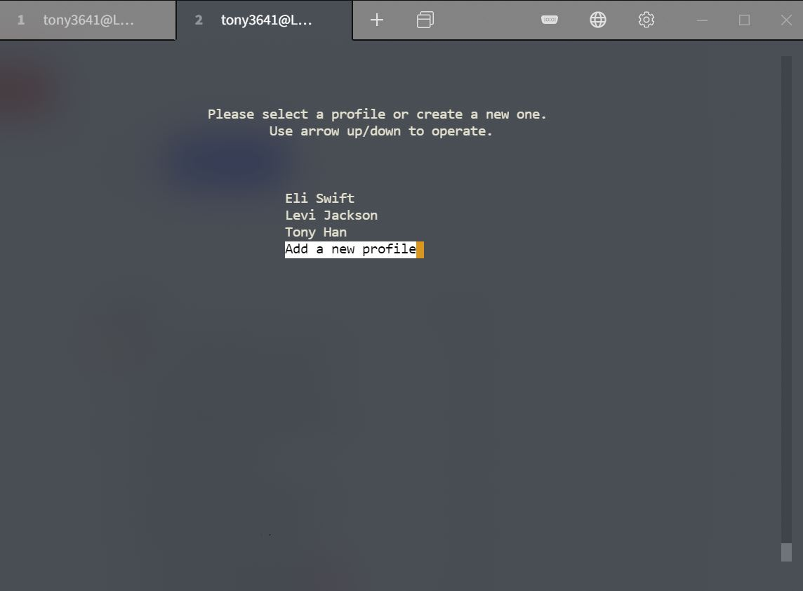
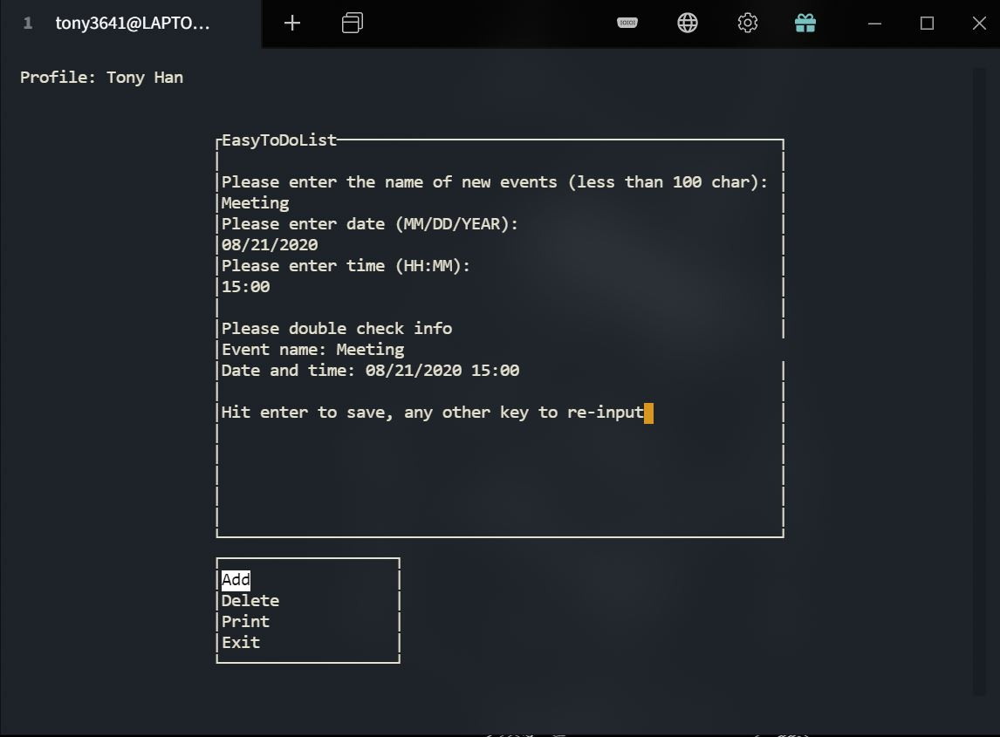

# EasyTodoList

A Linux terminal-based graphical to-do list management tool

## What's new

Version 1.2 Update:

​	Bug fixed when ```ctrl-c```/```cmd-c``` is called.

Version 1.1 Update:

​	Now the profile selection function is available.

## Intro

EasyToDoList is a to-do list management tool running on the command line with the "graphics window". The graphical window offers a more straightforward user experience and the user will no longer need to memorize commands to use. The user can add, delete and view the events stored by external data files so events data won't be lost 
when the computer restarts.


<div style="text-align: center;"></div>


---


You can create different profile to save events separately every time you launch the application.

<div style="text-align: center;"></div>

---


<div style="text-align: center;"></div>

## Approach

The program **relies on** ```ncurses``` library to construct a terminal-based graphical window to prompt the user's input. Two sub-windows were created. They are win and menu. Win was used to show information as a screen. Menu was used to prompt the user's operation. Data-wise, the events data were implemented by a singly linked list. The program will load the corresponding data file and save the data to a linked list after a specific profile is selected/created. Each node is an event. When a new event is created, the program inserts the new node to the list.


## Compatibility and program generation

The source code and Makefile file are included in the folder. All the user need to do is to compile the source code by running ```make``` and the compiler will generate executable based on the system. So, the program is theoretically compatible will all platforms with GCC installed. However, the flag ```-lncurses``` was added for compilation. Make sure your GCC has ```ncurses.h```. Otherwise, you will need to externally add the library to your GCC. You can download it here: https://ftp.gnu.org/pub/gnu/ncurses/


## How to compile

Note: this project only includes **source code**. So you will need to compile the code to generate your own version of the program.

First, you will need to clone the code repository:

```
git clone https://github.com/tony3641/EasyTodoList.git
```

Then, just in case, clean the workspace:

```
make clean
```

This, will clear all unnecessary data files and object files.

Now, we are ready to compile the code:

```
make
```

Some warnings may show up but you can totally ignore them (will be fixed later)

Now, in theory, the program should be ready to go. To launch the program, simply run

```
./list
```

And you window should then be switched to the graphical interface.


## Instruction and notice of use

**Once you enter the program:**

The program will ask the user to select a profile or make a new one. By using ```up/down``` arrow key the user can make their selection.
Notice: when naming a profile, the length of the name should be smaller than 100 characters.

**Once the profile is selected:**

New windows will be generated and now the program is ready to execute Add/Delete/Print operations. Press ```up/down``` arrow key to change highlighted option and hit ```Enter``` to run the option. When adding events, simply follow the instruction in the program.

**Notice**

- for the name of the events, please enter less than 100 characters
- for date of the events, the program assumes the length of the input is strictly 10 (```MM/DD/YYYY```). However, you can use any other char instead of ```/``` since the program only cares about certain positions containing date information.
- for the time of the events, the program assumes the length of the input is strictly 5 (```HH:MM```). Same here, you do not necessarily need to use ```:```.
- the ```ctrl-c```/```cmd-c``` signal is properly handled by using functions from ```signal.h```. Feel free to hit ```ctrl-c```/```cmd-c``` and your data will still remain. However, the recommended way to exit the program is still "Exit" option in the menu.

**WARNING**:

​	You may lose **ALL** events data when command ```make clean``` is called!